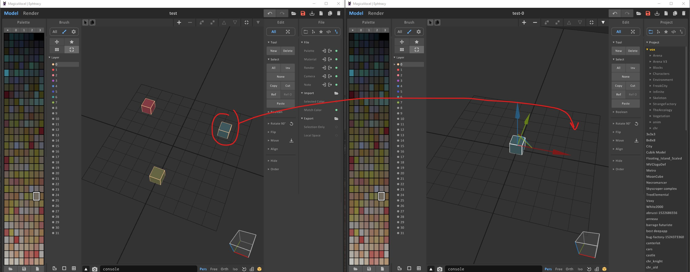

# VoxExporter
VoxExporter is a tool that export regions of a vox files into different vox files while keeping world positions

When you export all regions of your .vox file, MagicaVoxel doesn't keep the world positions of each regions. This tool fix this problem. 

# MagicaVoxel Vox Exporter

# Usage

- You need to open a console (like cmd or Powershell in Windows)
- Go to the emplacement of the binary
- Launch the command : `./VoxExporter.exe --i [INPUT] --o [OUTPUT]`
- [INPUT] refer to a vox filepath (mandatory)
- [OUTPUT] refer to the destination path (mandatory)
